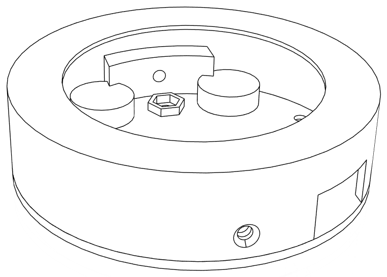

# IO Badge
This project explores the possibilities of integrating a circular display with a raspberry pi zero W in an integrated set-up. Current use case: interactive badges that can be used to show off 🕶️.

# Hardware
- [ ] [HyperPixel2r](https://www.elektor.com/hyperpixel-2-1-round-hi-res-display-for-raspberry-pi) from Pimoroni
- [ ] [Raspi Zero WH2](https://www.raspberrypi.com/products/raspberry-pi-zero-2-w/) (the H version has headers)
- [ ] Micro USB to USB A cable (power)
- [ ] [USB Battery Pack](https://voltaicsystems.com/v25/) // to be explored: Lipo + [LiPo Rider](https://www.kiwi-electronics.com/en/lipo-rider-plus-charger-booster-5v-2-4a-usb-type-c-9960)
- [ ] [3D printed case](https://a360.co/3FlakQw)
- [ ] [M2.5 stand-offs, nuts and bolts](https://www.adafruit.com/product/3299)
- [ ] M2.5 threaded inserts

<div align="center">  
  
</div>

# Installation
* Burn raspi OS [[Buster](https://downloads.raspberrypi.com/raspios_lite_armhf/images/raspios_lite_armhf-2021-05-28/)] on a fresh pi
* This works best headless
    * Add a file named ```wpa_supplicant.conf``` to the BOOT folder on the sd card (not the ROOT)
        * Make sure it is encoded as EOL > Unix
        * Add the following:
            ```ini
            country=BE
            ctrl_interface=DIR=/var/run/wpa_supplicant GROUP=netdev
            update_config=1

            network={
                ssid="SSID"
                psk="password"
                scan_ssid=1
            }
            ```
    * Add a file in the same directory called ```ssh``` (without extention, this allows to enter the pi using SSH)
    * Note to self: this didn't work on my Telenet router, but did work on the repeater
    * Enter Sd card, power up, and give the device some time to boot (reboot can be needed after initial boot)

* Update pi (this will take a while)
    ```console
    sudo apt update
    sudo apt upgrade -y
    ```
* Install git
    ```console
    sudo apt install git -y
    ```
* Python should be already installed. If you want to check this (& pip)
    ```console
    python3 --version
    sudo apt install python3-pip -y
    pip3 --version
    ```
* Get the Pimeroni driver & install
    ```console
    git clone https://github.com/pimoroni/hyperpixel2r
    cd hyperpixel2r
    sudo ./install.sh
    sudo reboot
    ```
* Check boot/config.txt (or /boot/firmware/config. txt). At the end of the file, you should see
    ```ini
    # Hyperpixel configuration
    dtoverlay=hyperpixel2r
    enable_dpi_lcd=1
    dpi_group=2
    dpi_mode=87
    dpi_output_format=0x7f216
    dpi_timings=480 0 10 16 55 480 0 15 60 15 0 0 0 60 0 19200000 6
    ```
* After reboot, you should see a CLI interface on the display

* Install pygame depencies
    ```console
    sudo apt install -y python3-dev python3-pip libsdl2-dev libsmpeg-dev libportmidi-dev  \
    libsdl2-mixer-2.0-0 libavformat-dev libswscale-dev libjpeg-dev libtiff5-dev libx11-6  \
    libsdl2-net-dev libsdl2-image-2.0-0 libpng-dev libsdl2-ttf-2.0-0

    ```
* Update pygame (you need a pygame version above 2.x, but the latest pygame version seems to be giving issues)   
    ```console
    pip3 install pygame==2.1.3 --no-cache-dir
    python3 -c "import pygame; print(pygame.__version__)"
    ```
* Reboot system
* Get the code and media directly from GitHub
    ```console
    git clone https://github.com/basbaccarne/io_badge/
    ```
* Testrun the code (simple) 
    ```console
    python3 io_badge/tests/pygame_simple.py
    ```

* Testrun the code (main) 
    ```console
    python3 io_badge/src/main.py
    ```

* set-up **auto boot**
   * Create service
     ```console
     sudo nano /etc/systemd/system/videoplayer.service
     ```
   * Add this code
     ```ini
     [Unit]
     Description=Autostart Video Player on Boot (Framebuffer)
     After=multi-user.target
     Wants=multi-user.target
     
     [Service]
     User=pi
     Group=pi
     Type=simple
     ExecStart=/usr/bin/mpv --fs --loop=inf /home/pi/io_badge/img/test_optimized.mp4
     WorkingDirectory=/home/pi
     Restart=always
     RestartSec=5
     Environment=DISPLAY=:0
     TTYPath=/dev/tty1
     
     [Install]
     WantedBy=multi-user.target
     ```
  * Enable the service
    ```console
    sudo systemctl daemon-reload
    sudo systemctl enable videoplayer.service
    sydo systemctl start videoplayer.service
    ```

## Subchallenge: playing visuals on a raspberry pi zero W

Visualising animations on this set-up can be done in 4 ways.

* mpv (best performance for videos)
* fbi (image sequences)
* pygame (interactive image sequences)
* PIL (ultra lightweight rendering)

### mpv   

**Create video**   
You can create videos from e.g. protopie (click record in the preview window to save as mp4).    

**Optimize video**   
resolution of 480x480, 30 FPS, no sound, ultrafast, bitrate of 30 (don't do this if you need acurate colors)   

```console
ffmpeg -i img/test.mp4 -vf "scale=480:480,fps=30" -c:v libx264 -preset ultrafast -crf 30 -an img/test_optimized.mp4
```

**Play the video**   
You can play this video with mpv (install if needed)   

```console
sudo apt install mpv -y
mpv --fs --loop=inf /home/pi/io_badge/img/test_optimized.mp4
```

## Subchallenge: animated vector-based images to pygame
Let's start at the beginning. If we want to create an animation, we need to first design and animate a concept. I believe that Figma has the best balance between creative flexibility and intuitive controls. For more advanced animations you can work in Adobe After Effects, Krita, etc. 

**Animations in Figma**
* Create animations by using frames that are interconnected using small delays and smart animations (elements with the same name are interpreted as the same element) [[sample](https://www.figma.com/design/7HCxisRHbDd5nCdcb7xBon/animation?node-id=0-1&t=ho44WM4fuoWQwnLI-1)].
* Activiate the Lottefiles plugin and upload the flow to Lottie [[sample](https://lottiefiles.com/free-animation/example-ibx1J4zz1J)].
* download the lottefile as a GIF in the original size (set required framerate). On low resource systems, low framerates are recommended [[sample, 30 FPS](/img/example.gif)].

**Animated GIFs in Python**
* PyGame can be a bit though in handling animations.
* The most resource effective way is to create ````spritesheet```` with the individual frames of the animation
* A good solution is to do this using ```FFmpeg```   

    (you might need to restart the terminal after installation)   
    (the 'frames' folder must exist)

    * Split the gifs in individual PNGs

        ```console
        winget install ffmpeg
        ffmpeg -i img/example.gif img/frames/frame_%04d.png
        ```

    * Merge into a spritesheet (change the dimensions, beware: ffpmpeg has filesize limits!)
        ```console
        ffmpeg -framerate 30 -i img/frames/frame_%04d.png -filter_complex "[0:v]tile=10x12" img/spritesheet.png
        ```
* This spritesheet can now be rendered in PyGame (see [example code](tests/pygame_gif.py))


<div align="center">  
  
</div>

However, rendering in PyGame on a raspi zero is challenging and should be kept to a minimum. Preferably only when interaction is needed.   

### Subchallenge: reducing resources on the pi
A smooth 30FPS animation based on a spritesheet can be challenging in a raspi pi zero w, which has limited resources, even on a zero W2 the FPS for full screen 480x480 pngs in a spritesheet is a bit too munch. Paths to explore:
- [x] Free up system resources 
    ```console
    sudo systemctl disable bluetooth
    sudo systemctl stop avahi-daemon
    sudo systemctl stop hciuart
    ```
    
    ```Verdict```: still too slow

- [x] Disable camera (```sudo raspi-config``` > Select 'Interfacing Options' -> 'Camera' -> Disable)

   ```Verdict```: still too slow

- [x] Increase video memory
    * ```sudo nano /boot/config.txt```
    * add ```ini gpu_mem=128```
      
   ```Verdict```: still too slow

- [x] animated GIF directly ([test script](tests/pygame_directgif.py))

  ```console   
  pip install pillow
  ``` 
  ```Verdict```: still too slow

- [x] Use individual images instead of spritesheet (png) ([tests script](tests/pygame_individualpngs.py))
      
  ```Verdict```: still too slow, but significantly better

- [x] Use BMP instead of png

  ```console
  ffmpeg -i img/example.gif img/frames/frame_%04d.bmp
  ```

  ```Verdict```: still too slow

**CONCLUSION:** running animated GIFs in pygame is challenging on a raspi zero w 2. Running video's works, for for PyGame it is better design in PyGame as much as possible and to keep it as simple as possible. 

## Inspiration

https://www.youtube.com/watch?v=l75A9TUMXOs   
https://www.youtube.com/watch?v=mqSe_uMpxIs   
https://www.youtube.com/watch?v=cZTx7T9uwA4   
https://www.youtube.com/watch?v=GosqWcScwC0
